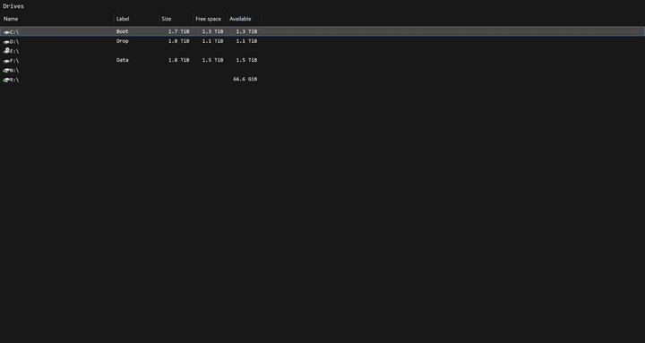
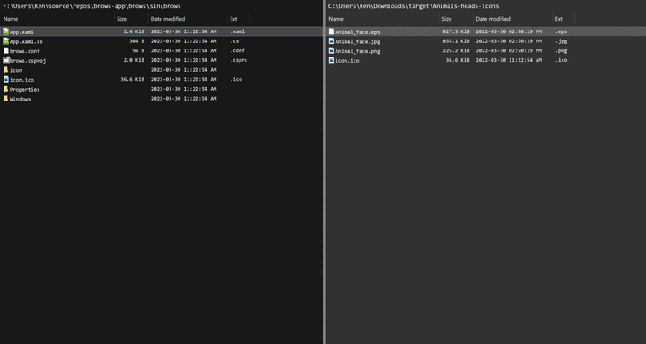
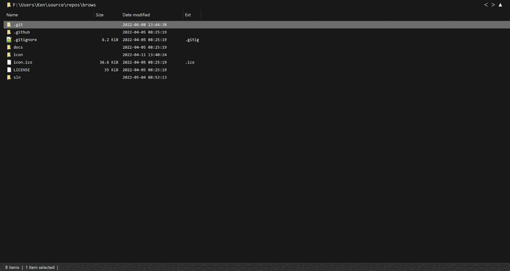
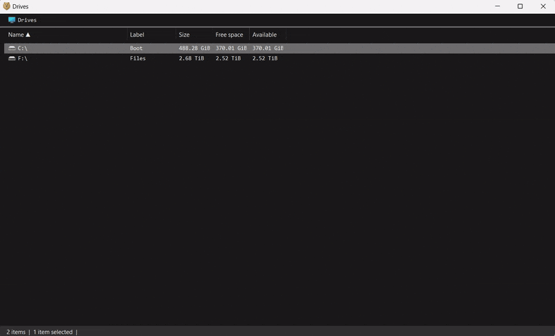

# Brows

**Brows is a keyboard-first file manager for Windows.** It replaces click-heavy file
browsing with a command palette: press `Ctrl+L`, then type a path, bookmark, search,
theme, shell command, or SSH connection.

```powershell
winget install Brows.App
```

[Download a release](https://github.com/brows-app/brows/releases) ·
[Report a bug or request a feature](https://github.com/brows-app/brows/issues) ·
[View the project site](https://brows.app)

## Features

- **Command palette** — navigate directly to paths, run commands, open bookmarks, and
  change settings without leaving the keyboard.
- **Bookmarks** — press `Ctrl+D` to save the current location, then find it later from
  the palette.
- **Keyboard selection and copy** — hold `Shift` with the arrow keys to select entries,
  then copy them with a shortcut or the command palette.
- **Inline previews** — press `Alt+P` to preview image and text files beside the file list.
- **Configurable columns** — use `show` and `hide` commands to display only the metadata
  you need.
- **Themes** — switch between dark and light themes, or set custom foreground and
  background colors.
- **Find by pattern** — press `Ctrl+F` to search for files and folders; move through
  results with `Alt` and the arrow keys.
- **Integrated CLI processes** — press `Shift+>` to run a command in the current directory
  and keep its output in place.
- **Remote browsing** — connect with `ssh` and browse a remote Linux file system using the
  same panels, commands, and shortcuts.

| Bookmarks | Preview |
| --- | --- |
|  |  |

| Find | Remote browsing |
| --- | --- |
|  |  |

## Development

Brows is a .NET 10 WPF application for Windows. The solution also includes native C
projects for interoperability with libcurl, libgit2, and libssh2; builds therefore require
the .NET 10 SDK and Visual Studio with the C++ x64 toolset.

From a Visual Studio Developer Command Prompt:

```powershell
cd sln
msbuild brows.slnx /p:Configuration=Debug /p:Platform=x64 /restore /verbosity:minimal
```

The executable is written to `sln\out\Debug\brows.exe`. See
[`sln/AGENTS.md`](sln/AGENTS.md) for the solution layout, targeted test commands, and
contributor conventions.

## License

Brows is licensed under the [GNU General Public License v3.0](LICENSE).
