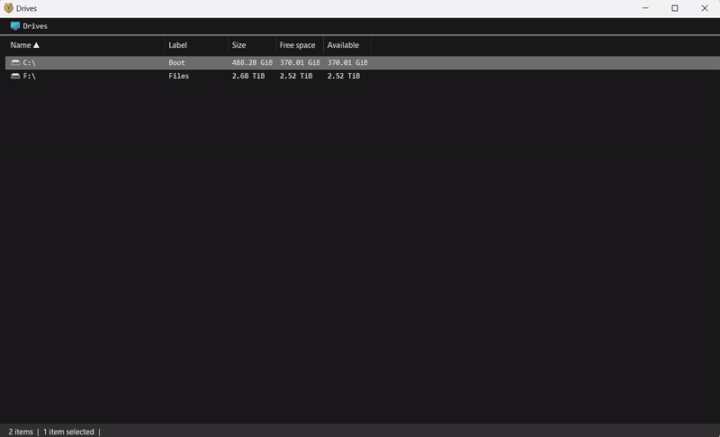

**Brows** is a file manager for power users.

***Control+N*** opens a new panel.

***Tab*** cycles through panels.

***Control+L*** launches the command palette. From there, type commands or paths to navigate the file system.

Install with winget `winget install Brows.App`

Download releases **[here](https://github.com/brows-app/brows/releases)**.

Report bugs and make feature requests **[here](https://github.com/brows-app/brows/issues)**.

--------

***Control+B*** bookmarks a location. To open it later, launch the command palette and start typing its name.

Select files by pressing ***SHIFT*** and the arrow keys, and copy them to another location with keyboard shortcuts or the command palette.

Preview image and text files with ***ALT+P***.

Show and hide columns with the **show** and **hide** commands.

Change the theme from dark to light with the **theme** command. In December, turn **Brows** into a Christmas tree by setting arbitrary background and foreground colors.

Find files and folders by pressing ***CONTROL+F*** and entering a pattern. Navigate through the results with ***ALT*** and the arrow keys.

Run CLI processes by pressing ***SHIFT+>*** and entering your command.

Browse a remote Linux file system with ***ssh***.

