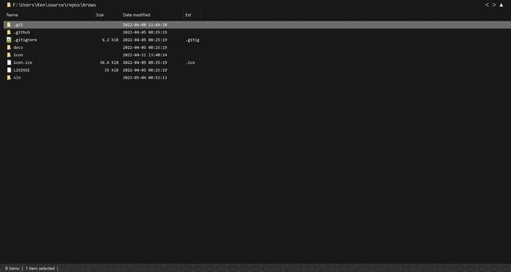

---
layout: default
title:          How to find files and folders with Brows
filename:   faq_how-to-find-files-and-folders-with-brows.md
permalink: /faq/how-to-find-files-and-folders-with-brows
--- 

Find files and folders by pressing ***CONTROL+F*** and entering a pattern. Navigate through the results with ***ALT*** and the arrow keys.

